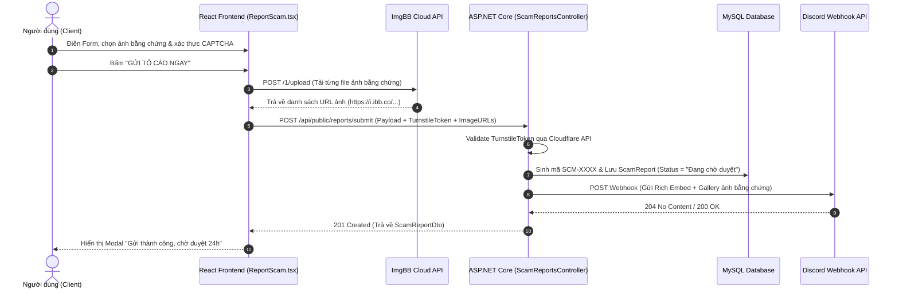
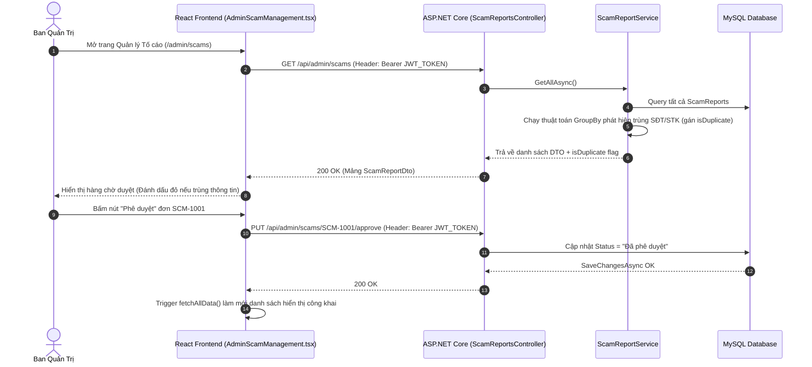

# BẢN ĐỒ KIẾN TRÚC & LUỒNG DỮ LIỆU TOÀN DIỆN (CODEBASE & DATA FLOW MAP)
**Dự án: Check Zone / Check Legit (Backend: BE_CheckZone | Frontend: Check_Legit_FE)**
*Tài liệu kỹ thuật chuyên sâu dành cho System Architect & AI Coding Assistants*

---

## 1. TỔNG QUAN CÔNG NGHỆ & KIẾN TRÚC (TECH STACK & PATTERNS)

### 1.1 Technology Stack

#### Frontend (`Check_Legit_FE` / `src`)
- **Core Framework**: React 19 (`react` `^19.0.1`, `react-dom` `^19.0.1`), TypeScript (`~5.8.2`).
- **Build Tool & Dev Server**: Vite 6 (`vite` `^6.2.3`), `@vitejs/plugin-react` `^5.0.4`.
- **Routing**: React Router DOM v7 (`react-router-dom` `^7.15.1`).
- **Styling & UI**: TailwindCSS v4 (`@tailwindcss/vite` `^4.1.14`, `tailwindcss` `^4.1.14`), Google Material Symbols (`material-symbols-outlined`), Lucide React icons (`lucide-react` `^0.546.0`), Framer Motion (`motion` `^12.23.24`).
- **External Integrations**:
  - Cloudflare Turnstile (Anti-Bot CAPTCHA validation).
  - ImgBB API (Lưu trữ ảnh bằng chứng tố cáo công khai qua `https://api.imgbb.com/1/upload`).

#### Backend (`BE_CheckZone` / `check_legit_BE/CheckZone.Api`)
- **Framework & Runtime**: ASP.NET Core 8 Web API (`net8.0`).
- **Database ORM**: Entity Framework Core 8 (`Pomelo.EntityFrameworkCore.MySql` `Version 8.0.*`, `Microsoft.EntityFrameworkCore.Tools`).
- **Database Engine**: MySQL (Tương thích tự động với MySQL 8.0 / MariaDB, hỗ trợ tự động kết nối qua Railway / Cloud MySQL).
- **Security & Auth**: JWT Bearer Authentication (`Microsoft.AspNetCore.Authentication.JwtBearer` `8.0.*`).
- **API Documentation**: Swagger / Swashbuckle OpenAPI 6 (`Swashbuckle.AspNetCore` `6.6.2`).
- **External Integrations**:
  - Discord Webhook API (Gửi thông báo real-time khi có tố cáo mới).
  - Cloudflare Turnstile Siteverify API (`https://challenges.cloudflare.com/turnstile/v0/siteverify`).

---

### 1.2 Design Patterns & Software Architecture

1. **Dependency Injection (DI) Pattern**:
   - Backend đăng ký dịch vụ theo đúng nguyên tắc IoC (Inversion of Control) tại `Program.cs`:
     - `IScamReportService` -> `ScamReportService` (`AddScoped`)
     - `ILegitProfileService` -> `LegitProfileService` (`AddScoped`)
     - `IDiscordNotificationService` -> `DiscordNotificationService` (`AddSingleton`)
     - `IHttpClientFactory` (`AddHttpClient()`)
2. **Service / Repository Abstraction Pattern**:
   - Controller không làm việc trực tiếp với `AppDbContext` (trừ `SystemSettingsController` đơn giản). Logic nghiệp vụ được đẩy hoàn toàn xuống các Service C# dạng Abstraction Interfaces (`IScamReportService`, `ILegitProfileService`).
3. **Data Transfer Object (DTO) Pattern**:
   - Tách biệt tuyệt đối giữa EF Core Entity Schema trong cơ sở dữ liệu (`ScamReport`, `LegitProfile`) và dữ liệu truyền qua HTTP API (`ScamReportDto`, `CreateScamReportDto`, `LegitProfileDto`, `CreateLegitProfileDto`).
4. **Singleton Scope Factory Pattern (Concurrency Safeguard)**:
   - `DiscordNotificationService` được đăng ký dạng `Singleton` để tối ưu kết nối HTTP. Để tránh lỗi lifetime leak khi truy vấn `AppDbContext` (vốn là `Scoped`), service này sử dụng `IServiceScopeFactory.CreateScope()` để đọc cấu hình webhook từ DB một cách an toàn.
5. **Context & Provider Pattern (Frontend)**:
   - `AppProvider` (`src/context/AppContext.tsx`) bọc toàn bộ ứng dụng React, quản lý state tập trung (`scams`, `legitList`, `token`, `systemSettings`) và cấp hook custom `useApp()` cho mọi UI component.

---

## 2. PHÂN TÍCH SÂU BACKEND (CheckZone.Api)

### 2.1 Database & Data Entities Schema

#### 1. `ScamReport` (`CheckZone.Api/Entities/ScamReport.cs`)
Đại diện cho 1 đơn tố cáo lừa đảo hoặc cảnh báo hành vi xấu.
```csharp
public enum ScamCategory { FinancialScam = 0, BehavioralWarning = 1 }

public class ScamReport {
    [Key][MaxLength(20)][Column("id")] public string Id { get; set; } = string.Empty; // e.g., "SCM-1001"
    [Required][MaxLength(255)][Column("name")] public string Name { get; set; } = string.Empty;
    [MaxLength(20)][Column("phone")] public string? Phone { get; set; }
    [Required][MaxLength(100)][Column("bank_name")] public string BankName { get; set; } = string.Empty;
    [Required][MaxLength(50)][Column("account_number")] public string AccountNumber { get; set; } = string.Empty;
    [Required][Column("desc", TypeName = "text")] public string Desc { get; set; } = string.Empty;
    [Required][MaxLength(100)][Column("type")] public string Type { get; set; } = string.Empty;
    [Required][Column("amount", TypeName = "decimal(15, 2)")] public decimal Amount { get; set; } = 0m;
    [Required][MaxLength(50)][Column("status")] public string Status { get; set; } = "Đang chờ duyệt";
    [Required][MaxLength(100)][Column("victim")] public string Victim { get; set; } = "Ẩn danh";
    [Required][Column("tags")] public List<string> Tags { get; set; } = new(); // Dynamic EF JSON mapping
    [MaxLength(512)][Column("facebook")] public string? Facebook { get; set; }
    [Required][Column("images")] public List<string> Images { get; set; } = new(); // Array of ImgBB URLs
    [Required][Column("created_at")] public DateTime CreatedAt { get; set; } = DateTime.UtcNow;
    [Required][Column("category")] public ScamCategory Category { get; set; } = ScamCategory.FinancialScam;
    [MaxLength(255)][Column("verifier_name")] public string? VerifierName { get; set; }
    [MaxLength(50)][Column("verifier_zalo")] public string? VerifierZalo { get; set; }
    [Required][Column("report_count")] public int ReportCount { get; set; } = 1;
}
```

#### 2. `LegitProfile` (`CheckZone.Api/Entities/LegitProfile.cs`)
Hồ sơ thương nhân uy tín được ban quản trị xác minh và bảo trợ bảo hiểm.
```csharp
public class LegitProfile {
    [Key][DatabaseGenerated(DatabaseGeneratedOption.Identity)][Column("id")] public int Id { get; set; }
    [Required][MaxLength(255)][Column("name")] public string Name { get; set; } = string.Empty;
    [Required][MaxLength(255)][Column("role")] public string Role { get; set; } = string.Empty;
    [Required][Range(0, 100)][Column("score")] public int Score { get; set; } = 100;
    [Required][MaxLength(512)][Column("img")] public string Img { get; set; }
    [Required][Column("desc", TypeName = "text")] public string Desc { get; set; } = string.Empty;
    [Required][MaxLength(20)][Column("phone")] public string Phone { get; set; } = string.Empty;
    [Required][MaxLength(100)][Column("telegram")] public string Telegram { get; set; } = "@verified_merchant";
    [Required][Column("insurance", TypeName = "decimal(15, 2)")] public decimal Insurance { get; set; } = 0m;
    [Required][Column("success_trans")] public int SuccessTrans { get; set; } = 0;
    [Required][MaxLength(7)][Column("join_date")] public string JoinDate { get; set; } = string.Empty; // Format: MM/YYYY
    [Required][MaxLength(255)][Column("business_type")] public string BusinessType { get; set; } = string.Empty;
    [MaxLength(512)][Column("facebook")] public string? Facebook { get; set; }
    [MaxLength(500)][Column("address")] public string? Address { get; set; }
    [MaxLength(255)][Column("website")] public string? Website { get; set; }
}
```

#### 3. `SystemConfiguration` (`CheckZone.Api/Entities/SystemConfiguration.cs`)
Cấu hình hệ thống toàn cục (Discord Webhook, Telegram Bot Token, Tiền bảo hiểm tối thiểu).
```csharp
public class SystemConfiguration {
    [Key][Column("id")] public int Id { get; set; } = 1;
    [Column("require_evidence")] public bool RequireEvidence { get; set; } = true;
    [Column("auto_approve")] public bool AutoApprove { get; set; } = false;
    [Column("min_insurance", TypeName = "decimal(15,2)")] public decimal MinInsurance { get; set; } = 10000000.00m;
    [Column("admin_name")] public string AdminName { get; set; } = "Ban điều hành Check Zone Việt Nam";
    [Column("admin_email")] public string AdminEmail { get; set; } = "support@checkzone.vn";
    [Column("telegram_bot_token")] public string? TelegramBotToken { get; set; }
    [Column("discord_webhook_url")] public string? DiscordWebhookUrl { get; set; }
}
```

---

### 2.2 Controllers & API Endpoints Table

| Controller | Method | Path Route | Authorize | Logic Tóm Tắt |
|---|---|---|---|---|
| **`AuthController`** | `POST` | `/api/auth/login` | Public | Đăng nhập Admin (`admin`/`admin123`). Trả về JWT Token hết hạn sau 7 ngày. |
| **`ScamReportsController`** | `GET` | `/api/public/scams` | Public | Lấy danh sách lừa đảo tài chính đã phê duyệt (`Status == "Đã phê duyệt"`, `Category == 0`). |
| | `GET` | `/api/public/warnings` | Public | Lấy danh sách cảnh báo hành vi đã phê duyệt (`Status == "Đã phê duyệt"`, `Category == 1`). |
| | `GET` | `/api/public/reports/search` | Public | Tìm kiếm báo cáo công khai theo tên, số điện thoại, ngân hàng, STK (`?query=...`). |
| | `GET` | `/api/public/scams/{id}` | Public | Lấy chi tiết đơn tố cáo theo ID (VD: `SCM-1001`). |
| | `POST` | `/api/public/reports/submit` | Public | Gửi đơn tố cáo mới (Validate Turnstile CAPTCHA -> Tạo `SCM-xxxx` -> Bắn Discord Webhook). |
| | `GET` | `/api/admin/scams` | **Bearer JWT** | Lấy toàn bộ báo cáo (Duyệt/Chờ duyệt) + Tự động tính cờ `isDuplicate` nếu trùng SĐT/STK. |
| | `PUT` | `/api/admin/scams/{id}/approve`| **Bearer JWT** | Phê duyệt tố cáo (`Status` -> `"Đã phê duyệt"`). |
| | `PUT` | `/api/admin/scams/{id}` | **Bearer JWT** | Cập nhật thông tin chi tiết đơn tố cáo. |
| | `DELETE` | `/api/admin/scams/{id}/reject` | **Bearer JWT** | Xóa / Bác bỏ đơn tố cáo khỏi Database. |
| **`LegitProfilesController`**| `GET` | `/api/public/legit` | Public | Lấy danh sách thương nhân uy tín + Tự động tính `Tier` (Kim Cương / Bạch Kim / Vàng). |
| | `GET` | `/api/public/legit/{id}` | Public | Lấy chi tiết hồ sơ thương nhân theo `id` (int). |
| | `POST` | `/api/admin/legit` | **Bearer JWT** | Tạo mới hồ sơ thương nhân uy tín. |
| | `PUT` | `/api/admin/legit/{id}` | **Bearer JWT** | Cập nhật thông tin thương nhân uy tín. |
| | `DELETE` | `/api/admin/legit/{id}` | **Bearer JWT** | Xóa hồ sơ thương nhân uy tín. |
| **`SystemSettingsController`**|`GET` | `/api/admin/settings` | **Bearer JWT** | Tải cấu hình hệ thống (Id=1). |
| | `PUT` | `/api/admin/settings` | **Bearer JWT** | Cập nhật cấu hình hệ thống (Webhook URL, Tiền bảo hiểm tối thiểu...). |

---

### 2.3 Core Services Technical Logic

#### 1. `DiscordNotificationService.cs`
- **Mục đích**: Gửi thông báo Rich Embed kèm gallery ảnh minh chứng về kênh Discord của Admin ngay khi có tố cáo mới.
- **Điểm kỹ thuật quan trọng**:
  - Ưu tiên đọc `DiscordWebhookUrl` từ bảng `SystemConfigurations` trong MySQL thông qua `IServiceScopeFactory`. Nếu trống, tự động fallback sang các biến môi trường (`Discord__WebhookUrl`, `DISCORD_WEBHOOK_URL`).
  - **Tối ưu Gallery Ảnh Embed của Discord**: Discord quy định tối đa 10 embeds/tin nhắn. Service tạo 1 `mainEmbed` chứa toàn bộ thông tin đối tượng (Tên, SĐT, STK, Ngân hàng, Số tiền, Chi tiết) và gán ảnh thứ 1 vào `mainEmbed.image`. Các ảnh từ 2 đến 10 được tạo dưới dạng các embed phụ tối giản (`{ url, image: { url } }`), giúp Discord tự gom nhóm hiển thị dưới dạng Album/Gallery.
  - Sử dụng `await` trực tiếp trong `SubmitReportAsync` thay vì fire-and-forget để tránh Kestrel bị dispose scope khi chạy trên Cloud (Railway).

#### 2. `ScamReportService.cs`
- **Tạo Mã Định Danh Sinh Ngẫu Nhiên**: Sinh mã `SCM-XXXX` (với 4 chữ số ngẫu nhiên) và kiểm tra trùng lặp trong DB trước khi gán.
- **Phát Hiện Trùng Lặp Quét Thuật Toán (Duplicate Detection)**:
  Trong hàm `GetAllAsync()` (dành cho Admin):
  ```csharp
  var dupPhones = dtos.Where(x => !string.IsNullOrWhiteSpace(x.Phone))
      .GroupBy(x => x.Phone!.Trim())
      .Where(g => g.Count() > 1).Select(g => g.Key).ToHashSet(StringComparer.OrdinalIgnoreCase);

  var dupAccounts = dtos.Where(x => !string.IsNullOrWhiteSpace(x.AccountNumber))
      .GroupBy(x => x.AccountNumber.Trim())
      .Where(g => g.Count() > 1).Select(g => g.Key).ToHashSet(StringComparer.OrdinalIgnoreCase);
  ```
  Nếu SĐT hoặc STK của đơn tố cáo xuất hiện > 1 lần trong DB, thuộc tính `isDuplicate = true` sẽ được bật để cảnh báo Admin trên giao diện.

#### 3. `LegitProfileService.cs`
- **Phân Hạng Tự Động (Dynamic Tier System)**:
  Phân hạng thương nhân dựa trên số tiền quỹ bảo hiểm (`Insurance`):
  - `Insurance >= 500,000,000 VNĐ` -> **"Hạng Kim Cương"**
  - `Insurance >= 100,000,000 VNĐ` -> **"Hạng Bạch Kim"**
  - `Insurance < 100,000,000 VNĐ` -> **"Hạng Vàng"**

---

## 3. PHÂN TÍCH SÂU FRONTEND (`src`)

### 3.1 Routing Setup (`src/App.tsx`)
- Ứng dụng sử dụng `react-router-dom` v7.
- **`ScrollToTop` Component**: Tự động cuộn viewport về vị trí `(0,0)` khi người dùng chuyển trang.
- **`ProtectedAdminRoute` Component**: Kiểm tra sự tồn tại của `token` (JWT trong `localStorage`). Nếu chưa đăng nhập, tự động điều hướng sang `/login`.

```
Route Tree:
├── Public Routes (Wrapped in <Layout>):
│   ├── /                 -> Home (Tìm kiếm nhanh, Thống kê, Bài viết nổi bật)
│   ├── /report           -> ReportScam (Form gửi tố cáo lừa đảo & cảnh báo)
│   ├── /legit            -> LegitList (Danh bạ thương nhân uy tín)
│   ├── /legit/:id        -> LegitProfileDetail (Chi tiết thương nhân & Quỹ bảo hiểm)
│   ├── /reports          -> ScamList (Danh sách lừa đảo tài chính công khai)
│   ├── /reports/:id      -> ScamDetail (Chi tiết vụ lừa đảo & Bằng chứng ảnh)
│   ├── /warnings         -> Warnings (Danh sách cảnh báo hành vi bom hàng/hàng giả)
│   ├── /about            -> About (Giới thiệu & Điều khoản)
│   └── /login            -> Login (Trang đăng nhập Admin)
└── Protected Admin Routes (Wrapped in <ProtectedAdminRoute> & <AdminLayout>):
    ├── /admin            -> AdminOverview (Thống kê tổng quan hệ thống)
    ├── /admin/scams      -> AdminScamManagement (Hàng chờ duyệt/xóa tố cáo + Cảnh báo trùng)
    ├── /admin/legit      -> AdminLegitManagement (Thêm/Sửa/Xóa thương nhân)
    └── /admin/settings   -> AdminSettings (Cấu hình Webhook, Tiền bảo hiểm tối thiểu)
```

---

### 3.2 State Management (`src/context/AppContext.tsx`)

#### State Toàn Cục (Global State)
- `scams`: Danh sách các đơn tố cáo tài chính và cảnh báo hành vi.
- `legitList`: Danh sách hồ sơ thương nhân uy tín.
- `systemSettings`: Cấu hình hệ thống (nếu đã đăng nhập Admin).
- `token` / `isAuthenticated`: Quản lý JWT Token lưu trữ ở `localStorage`.

#### Hàm Xử Lý Gọi API Chính (Context Actions)
- `fetchScams()` & `fetchWarnings()`: Gọi API `/public/scams` và `/public/warnings` (hoặc `/admin/scams` nếu có Token). Tự động chuẩn hóa thời gian UTC sang giờ Việt Nam (`Asia/Ho_Chi_Minh`).
- `addScamReport(payload)`: Tải ảnh minh chứng lên ImgBB trước, sau đó gửi payload JSON kèm `turnstileToken` tới `/api/public/reports/submit`.
- `approveScamReport(id)` / `rejectScamReport(id)`: Thực hiện đổi trạng thái/xóa tố cáo với Header `Authorization: Bearer <token>`.
- `addLegitProfile(payload)` / `deleteLegitProfile(id)`: Thêm/xóa thương nhân uy tín.

---

### 3.3 Core UI Components

1. **`Layout.tsx`**: Khung nền giao diện công khai.
   - Header tích hợp thanh tìm kiếm nhanh (gọi API search), nút gửi tố cáo, chuyển đổi trạng thái Đăng nhập/Đăng xuất Admin.
   - Footer chứa các liên kết chính sách và thông tin liên hệ.
2. **`AdminLayout.tsx`**: Khung giao diện quản trị Admin.
   - Sidebar cố định bên trái (Tổng quan, Duyệt tố cáo, Danh bạ Legit, Cấu hình).
3. **`ReportScam.tsx`**: Form gửi tố cáo phức hợp.
   - Hỗ trợ đổi tab giữa **"Tố cáo lừa đảo tài chính"** (bắt buộc nhập số tiền) và **"Cảnh báo hành vi"** (bom hàng, thái độ toxic - mặc định 0đ).
   - Tải ảnh kéo-thả (Drag & Drop) tối đa 5 ảnh (<5MB/ảnh), tự động upload trực tiếp lên ImgBB API.
   - Tích hợp Cloudflare Turnstile CAPTCHA widget.

---

## 4. LUỒNG DỮ LIỆU TÍCH HỢP (INTEGRATION DATA FLOWS)

### Luồng 1: Quy Trình Gửi Tố Cáo Lừa Đảo (Create Scam Report Flow)



---

### Luồng 2: Quy Trình Admin Kiểm Duyệt & Phê Duyệt Tố Cáo (Admin Approval Flow)



---

## 5. HƯỚNG DẪN CHỈNH SỬA & LƯU Ý BẢO MẬT (MODIFICATION GUIDE)

### 5.1 Các File "Trung Tâm Thần Kinh" (Core Critical Files)

| File | Vai Trò & Cảnh Báo |
|---|---|
| `check_legit_BE/CheckZone.Api/Program.cs` | **Khởi chạy Backend**: Cấu hình kết nối MySQL (hỗ trợ Railway `MYSQLHOST` / `MYSQL_URL`), CORS allowed origins, Swagger, và JWT Authentication. **Thận trọng khi sửa middleware pipeline order!** |
| `check_legit_BE/CheckZone.Api/Data/AppDbContext.cs` | **ORM Mapping**: Khai báo các DbSet và quy tắc map JSON cho `Tags` và `Images`. Sửa file này cần tạo EF Migration (`dotnet ef migrations add`). |
| `src/context/AppContext.tsx` | **Trái tim State Frontend**: Nơi thực hiện toàn bộ các cuộc gọi `fetch()` HTTP API, quản lý Token và chuyển đổi múi giờ. Thay đổi DTO ở Backend phải cập nhật `mapScamDto` tại đây. |
| `src/App.tsx` | **Routing chính**: Khai báo các đường dẫn và logic bảo vệ route `ProtectedAdminRoute`. |

---

### 5.2 Cấu Hình Biến Môi Trường (Environment Variables Schema)

#### Backend (`appsettings.json` / Dynamic Environment Variables)
- `ConnectionStrings:DefaultConnection`: Chuỗi kết nối MySQL mặc định.
- `MYSQLHOST`, `MYSQLUSER`, `MYSQLPASSWORD`, `MYSQLPORT`, `MYSQLDATABASE`: Tự động đọc biến môi trường từ Railway Cloud.
- `Jwt:Key`: Khóa bí mật mã hóa Token JWT (Tối thiểu 32 ký tự).
- `Discord:WebhookUrl` / `DISCORD_WEBHOOK_URL`: URL Webhook Discord nhận tin nhắn báo cáo.
- `Turnstile:SecretKey`: Secret Key Cloudflare Turnstile (Mặc định `1x00000000000000000000000000000000` cho chế độ Test).

#### Frontend (`.env` / `.env.local`)
- `VITE_API_BASE_URL`: URL gốc của Backend API (ví dụ: `https://checkzone-api.up.railway.app/api`).
- `VITE_IMGBB_API_KEY`: API Key dịch vụ ImgBB để tải ảnh minh chứng.
- `VITE_TURNSTILE_SITEKEY`: Sitekey công khai của Cloudflare Turnstile.

---

### 5.3 Điểm Nghẽn & Cần Tối Ưu Tương Lai (Architectural Gotchas)
1. **Xác thực CAPTCHA Bypass trong Dev Mode**:
   - Trong `ScamReportsController.cs`, nếu `Turnstile:SecretKey` bắt đầu bằng `1x0000000000`, backend sẽ luôn cho qua validation (`return true;`). Khi triển khai Production chính thức, bắt buộc phải thay Sitekey và Secretkey thật từ Cloudflare Dashboard.
2. **Cấu hình CORS trong Production**:
   - `Program.cs` thiết lập danh sách `allowedOrigins` bao gồm các cổng `localhost` và `https://check-legit-fe-demo.vercel.app`. Nếu deploy Frontend sang một tên miền Vercel/Custom Domain mới, cần cập nhật biến môi trường `FRONTEND_URL` trên Server Backend.
3. **Upload Ảnh Minh Chứng**:
   - Hiện tại Frontend tải ảnh trực tiếp lên ImgBB phía Client. Nếu ImgBB bị chặn hoặc thay đổi chính sách API, có thể chuyển sang build endpoint upload multipart/form-data trực tiếp ở Backend C#.
